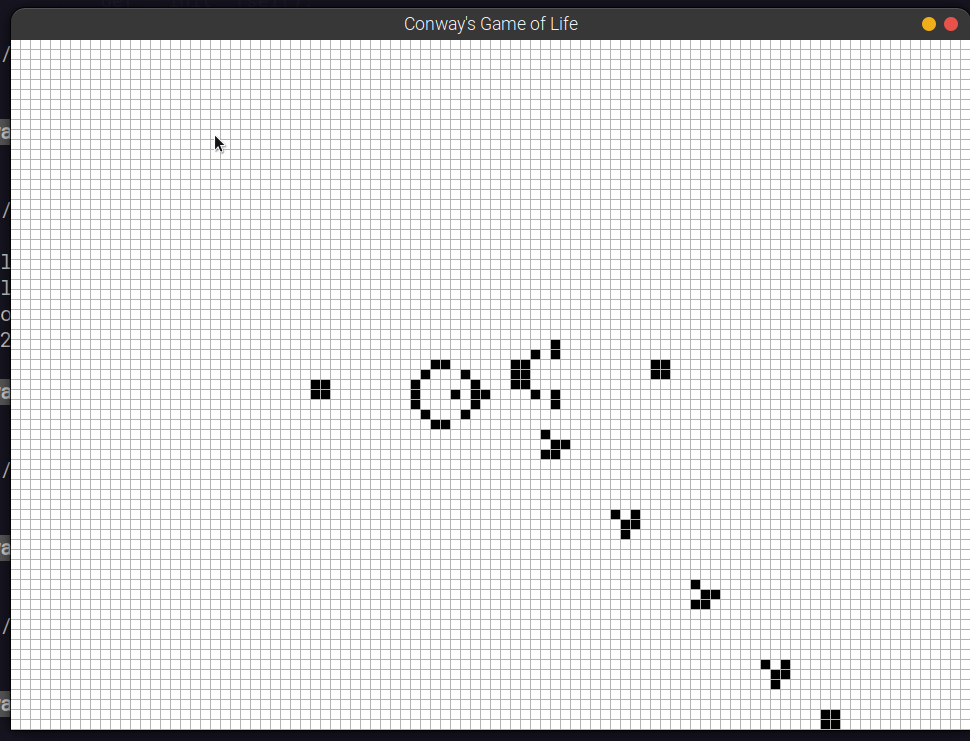
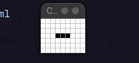
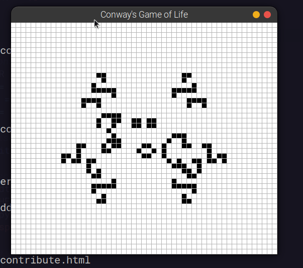

# Conway's Game of Life

An implementation of Conway's Game of Life I made after watching [this excellent video](https://youtu.be/Kk2MH9O4pXY). Program can read in RLE file format for a starting point. Runs on pygame.

## Usage:

Requires pygame:

```
pip install -r ./requirements.txt
```

Make necessary changes to the `FPS`, `FILENAME` variables in the `conway.py` file. If you want, you can change the padding around the loaded model by changing the `self.padding` variable in `conway_reader.py`.

You can also mess with the color of the cells in `conway.py` if you want.

Running:

```
python3 ./conway.py
```

## Demo:

### Glider Gun:



### Blinker:



### Hilbert:



## License

[MIT License](../LICENSE)

## Contribution

Pull Requests are always welcome, especially performance improvements, UX improvements or support for additional file formats.
